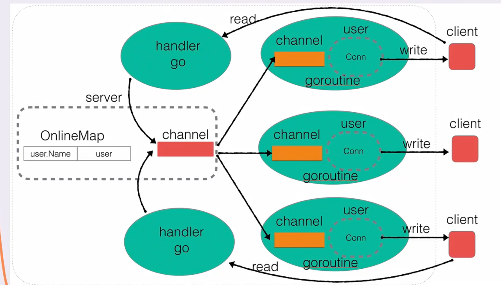

# 项目介绍

golang第一个练习项目，即时通信系统。2025年一月

## 项目名称

MSN：即时通信系统

## 项目简介

利用golang写一个日常在线聊天，私聊，公聊，基本的查询用户等功能

## 功能特性

迭代开发：

1.构建基础server
2.用户功能
3.用户消息广播机制
4.用户业务层封装
5.在线用户查询: 输入“who”就能查询当前在线用户
6.修改用户名： 输入“rename|newName”就能修改用户名为newName
7.超时强踢功能：如果用户长时间不活跃，则踢下线
8.私聊功能：输入“to|用户名|消息内容”则可以与指定用户私聊
9.客户端实现：终端形式



## 未来计划
将客户端从终端形式改为web形式。

## 技术栈

- **前端**：
- **后端**：GOlang
- **数据库**：

## 安装与使用


在项目文件夹打开终端输入：

启动服务器端：
```
go build -o server server.go user.go  main.go 

./server
```

启动客户端：
```
go build -o client client.go 

/.client
```